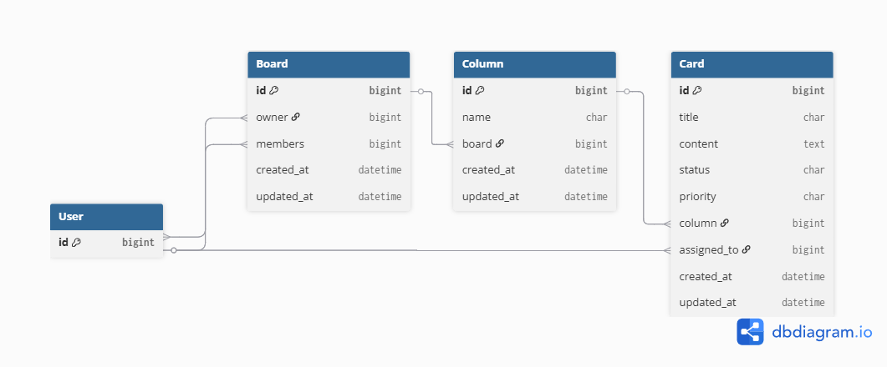

# CardBoard 📋

A **Trello-like project management app** built as a fullstack exercise to demonstrate hands-on skills with Django/DRF and Remix/React Router.

> Built in ~4 days from scratch — no prior Remix experience.

---

## Stack

| Layer | Technology |
|-------|-----------|
| Backend | Django + Django REST Framework |
| Frontend | Remix (React Router v7) |
| Auth | JWT (simplejwt) — access token 5min + refresh 1 day |
| Session | Cookie httpOnly — token never exposed to browser |
| DB | PostgreSQL  |

---

## Database

4 tables — `User` (provided by Django), `Board`, `Column`, `Card`.



### Relations
- `Board.owner` → User *(ForeignKey — many boards to one user)*
- `Board.members` ↔ User *(ManyToMany — a board has many members, a user can be in many boards)*
- `Column.board` → Board *(ForeignKey CASCADE — many columns to one board)*
- `Card.column` → Column *(ForeignKey CASCADE — many cards to one column)*
- `Card.assigned_to` → User *(ForeignKey nullable — a card can be assigned to one user)*

> CASCADE means: delete a Board → all its Columns are deleted → all their Cards are deleted automatically.

---

## Permissions & Authorization

There are **3 user levels** in CardBoard:

### 🔴 Superuser
- Can do everything on everything — bypasses all validation
- `validate()` returns data directly without any checks

### 🟠 Staff (Board Owner)
- Can **create** Boards
- On their own boards: full control — create, update, delete Columns and Cards
- Can assign Cards to members
- Can add/remove members from their Board

### 🟢 Normal User (Member)
- Can only see Boards they have been added to as a member
- Can create Cards on boards they are a member of
- Can only update Cards that are **assigned to them** (status, priority)
- Cannot modify title, assigned_to, or board structure

### 👁 Visibility rules

| User type | Can see |
|-----------|---------|
| Superuser | All boards |
| Staff (owner) | Only their own boards |
| Normal user | Only boards they are a member of |

> Unauthorized objects return **404** (not 403) — this prevents leaking information about the existence of resources.

---

## REST API

The API is built with Django REST Framework using `ModelViewSet` and a `DefaultRouter`.

### Endpoints

| Method | URL | Action |
|--------|-----|--------|
| GET | `/api/boards/` | List boards (filtered by user) |
| POST | `/api/boards/` | Create board (staff only) |
| GET | `/api/boards/{id}/` | Retrieve board |
| PATCH | `/api/boards/{id}/` | Update board |
| DELETE | `/api/boards/{id}/` | Delete board |
| GET | `/api/columns/?board={id}` | List columns for a board |
| POST | `/api/columns/` | Create column |
| PATCH | `/api/columns/{id}/` | Update column |
| DELETE | `/api/columns/{id}/` | Delete column |
| GET | `/api/cards/?column={id}` | List cards |
| POST | `/api/cards/` | Create card |
| PATCH | `/api/cards/{id}/` | Update card |
| DELETE | `/api/cards/{id}/` | Delete card |
| GET | `/api/cards/card_choices/` | Get status & priority choices |
| POST | `/api/token/` | Login → returns access + refresh tokens |
| POST | `/api/token/refresh/` | Refresh access token |


---

## Security

- JWT stored in **httpOnly cookie** — token never accessible from JavaScript → protected against XSS attacks
- `get_queryset` as implicit security layer — unauthorized objects return **404**, not 403
- `fetchWithAuth()` on the Remix side — handles token refresh automatically on 401, redirects to login if refresh is expired

---

## Frontend — implemented features

- Login with JWT session stored in httpOnly cookie
- Board view: loads board + columns + cards + choices + members **in parallel** (`Promise.all`)
- Card status and priority update via auto-submit `onChange` forms
- Card creation and deletion
- Toast notifications via URL message passing
- One form open at a time per column (`openColumnId` state)

---

## Known limitations / future improvements

- No concurrent edit handling — optimistic locking with `updated_at` version check would solve this
- Frontend partially implemented — board and column CRUD not yet in the UI
- `perform_create` in BoardViewSet should auto-assign owner server-side for extra security

---

## Run Backend and Frontend

### Clone the repository in the same folder of the backend 


```bash
#backend-repo
cd ..
git clone https://github.com/irdof321/cardboard-frontend.git
```

### Launch the container

```bash
# build the image and launch the container
docker-compose up --build

# Populate the DB (firt time)
 docker container exec -it trello-like-app-backend-1  python manage.py migrate
 docker container exec -it trello-like-app-backend-1  python seed.py      
 # Check the name of your container it may change
```

