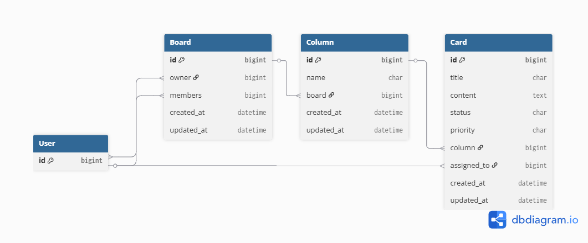

# CardBoard 📋


A **Trello-like** project management app: boards, columns, cards, members — with authentication delegated to **Keycloak** (OpenID Connect) instead of a homemade auth system.

> 📦 The frontend (Remix / React Router) lives in a **separate repository** ([`cardboard-frontend`](https://github.com/irdof321/cardboard-frontend)). This README covers the backend; the frontend section will be added here once its code has been reviewed.

---

## Table of contents

- [Tech stack](#tech-stack)
- [Architecture](#architecture)
- [Prerequisites](#prerequisites)
- [Installation and startup](#installation-and-startup)
- [Keycloak setup](#keycloak-setup)
- [Seeding the database](#seeding-the-database)
- [Data model](#data-model)
- [Roles and permissions](#roles-and-permissions)
- [Adding a user and assigning a role](#adding-a-user-and-assigning-a-role)
- [REST API](#rest-api)
- [Background tasks (Celery)](#background-tasks-celery)
- [Tests](#tests)
- [Project structure](#project-structure)
- [Known issues / bugs](#known-issues--bugs)

---

## Tech stack

| Layer | Technology |
|---|---|
| Backend | Django 6 + Django REST Framework |
| Authentication | Keycloak (OpenID Connect) via `mozilla-django-oidc` |
| Database | PostgreSQL 16 |
| Background tasks | Celery + Redis |
| Frontend | Remix (React Router v7) — *separate repository, not covered by this README* |
| Containerization | Docker / Docker Compose |

---

## Architecture

`docker-compose.yml` declares 6 services:

| Service | Role | Exposed port |
|---|---|---|
| `backend` | Django REST API | `8000` |
| `db` | PostgreSQL (shared by Django **and** Keycloak) | `5432` |
| `keycloak` | Authentication server (`cardboard` realm) | `8080` |
| `frontend` | Remix application | `3000` |
| `celery` | Celery worker (background jobs) | — |
| `redis` | Broker/backend for Celery | — |

```
Browser ──▶ frontend (3000) ──▶ backend (8000) ──▶ db (5432)
                                     │
                                     ├──▶ keycloak (8080) ──▶ db (5432)
                                     │
                                     └──▶ redis (6379) ◀── celery
```

> Keycloak and Django share the **same Postgres instance** (same `db` container), each with its own set of tables. That's fine for local development; in production you'd typically split them into two separate databases.

---

## Prerequisites

- Docker and Docker Compose
- Git
- The frontend repository cloned in the **parent** folder of this backend:

```bash
cd ..
git clone https://github.com/irdof321/cardboard-frontend.git
```

> If the frontend lives elsewhere, adjust the `build:` path of the `frontend` service in `docker-compose.yml`.

---

## Installation and startup

### 1. Environment variables

The `.env` file at the project root must contain at least:

```env
# Database
POSTGRES_USER=demo
POSTGRES_PASSWORD=demo
POSTGRES_DB=demo
POSTGRES_PORT=5432
POSTGRES_HOST=db
FRONTEND_HOST=frontend
FRONTEND_PORT=3000

# OAuth / Keycloak
OIDC_RP_CLIENT_ID=cardboard-backend
OIDC_RP_CLIENT_SECRET=<Keycloak client secret>
OIDC_OP_ENDPOINT=http://keycloak:8080/realms/cardboard/protocol/openid-connect
```

### 2. Start the containers

```bash
docker compose up --build
```

### 3. Apply migrations (first run)

```bash
docker compose exec backend python manage.py migrate
```

> Double-check the exact container name with `docker compose ps` if the command above fails (it may be suffixed with `-1`, e.g. `trello-like-app-backend-1`).

### 4. Configure Keycloak

See the dedicated section below — **required** for login to work, since Keycloak only creates the `cardboard` realm if you configure it yourself.

### 5. (Optional) Seed the database with test data

```bash
docker compose exec backend python seed.py
```

---

## Keycloak setup

`start-dev` only creates the `master` realm by default. You need to create the application realm by hand.

### 1. Access the admin console

- URL: **http://localhost:8080** (not `http://keycloak:8080` — that hostname only resolves *between* Docker containers)
- Credentials defined in `docker-compose.yml`: `admin` / `admin`

### 2. Create the realm

`Create realm` → name: **`cardboard`**

### 3. Create the client

`Clients` → `Create client`:
- **Client ID**: `cardboard-backend` (must match `OIDC_RP_CLIENT_ID` in `.env`)
- **Client authentication**: `On` (confidential client, it has a secret)
- **Authentication flow**: enable at least `Direct access grants` (needed for the `password` grant used by the backend, see `Client authentication` under the `Credentials` tab)

Once created, go to the client's **Credentials** tab to grab the **Client secret**, and paste it into `.env` (`OIDC_RP_CLIENT_SECRET`).

### 4. Create the application roles (realm roles)

`Realm roles` → `Create role`, create the following two roles:
- `django-staff`
- `django-superuser`

These roles are read by the backend on every login (see `website/auth.py`) and mapped directly onto the Django `is_staff` / `is_superuser` fields:

```python
roles = claims.get("realm_access", {}).get("roles", [])
user.is_staff = "django-staff" in roles
user.is_superuser = "django-superuser" in roles
```

> A user with **neither** of these two roles becomes a plain "member" on the Django side (`is_staff=False`, `is_superuser=False`).

---

## Seeding the database

> 🚫 **Strictly for development / testing — never run in production.**

The `seed.py` script creates users **directly in the Django database** (not in Keycloak), with hardcoded plaintext passwords. It's only meant to give you a dataset for quickly testing the API (by hand or via `test_api.py`). These accounts **cannot log in through the real Keycloak/frontend flow** unless they also exist on the Keycloak side.

```bash
docker compose exec backend python seed.py
```

Accounts created:

| Account | Password | Role | Boards |
|---|---|---|---|
| `irdof` | `321321` | Superuser | All |
| `admin` | `admin123` | Staff | — |
| `owner1` | `owner123` | Staff (owner) | Frontend, Backend |
| `owner2` | `owner123` | Staff (owner) | DevOps, Design |
| `user1` to `user5` | `user123` | Regular member | Depends on board |

> ⚠️ `seed.py` **deletes all existing data** (`User`, `Board`, `Column`, `Card`) before recreating the dataset.

---

## Data model

4 tables: `User` (provided by Django), `Board`, `Column`, `Card`.



| Relation | Type |
|---|---|
| `Board.owner` → `User` | ForeignKey — a board has a single owner |
| `Board.members` ↔ `User` | ManyToMany — a board has many members |
| `Column.board` → `Board` | ForeignKey, `CASCADE` |
| `Card.column` → `Column` | ForeignKey, `CASCADE` |
| `Card.assigned_to` → `User` | ForeignKey, nullable, `SET_NULL` |

> `CASCADE`: deleting a `Board` cascades to its `Column`s, which cascade to their `Card`s.

`Card` fields:
- `status`: `todo` / `in_progress` / `done`
- `priority`: `low` / `medium` / `high`
- `order`: position within the column

---

## Roles and permissions

There are **3 user levels**, determined by Keycloak roles (`django-staff`, `django-superuser`) at login time.

### 🔴 Superuser (`django-superuser`)
- Full access, no checks applied (`is_superuser` short-circuits all validation)
- Sees all boards, columns, cards

### 🟠 Staff / Owner (`django-staff`)
- Can **create Boards** (automatically becomes the owner)
- Full control over their own boards: create/update/delete columns and cards
- Can assign cards to members
- Only sees **their own boards** (not other owners' boards)

### 🟢 Regular user (no particular role)
- Only sees boards they are a **member** of
- Can create cards on boards they're a member of
- Can only update a card if it's assigned to them (`assigned_to`), and only `status` / `priority` — not the title or the assignment
- Cannot create/update/delete columns or boards

### Visibility

| User type | Sees |
|---|---|
| Superuser | All boards |
| Staff (owner) | Only their own boards |
| Regular user | Only boards they're a member of |

> An unauthorized object returns **404** (not 403) — this avoids leaking the existence of a resource to someone who shouldn't have access to it (`get_queryset` filters it out upstream).

---

## Adding a user and assigning a role

In production, Keycloak manages user accounts (not `seed.py`, which is dev-only).

### 1. Create the user

Keycloak admin console → `cardboard` realm → `Users` → `Add user`:
- Fill in `Username`, `Email`, `First/Last name`
- Save

### 2. Set a password

User's **Credentials** tab → `Set password` → uncheck `Temporary` if you don't want to force a password change on first login.

### 3. Assign a role (optional)

**Role mapping** tab → `Assign role`:
- No role → regular user (member)
- `django-staff` → can create and own boards
- `django-superuser` → full access

### 4. First login

On first login via OIDC, Django automatically creates the corresponding user (`create_user` in `website/auth.py`) with the correct `is_staff` / `is_superuser` derived from the realm roles. On every subsequent login, these fields are **resynced** (`update_user`) — so if you change a user's roles in Keycloak, it takes effect the next time they log in.

> A user only becomes a member of a board once an owner (staff) adds them to the board's `members` list via the API (`PATCH /api/boards/{id}/`) — Keycloak doesn't manage board membership, only identity and the global role.

---

## REST API

Built with `ModelViewSet` + `DefaultRouter`.

| Method | URL | Action |
|---|---|---|
| GET | `/api/boards/` | List boards (filtered by user) |
| POST | `/api/boards/` | Create a board (staff only) |
| GET | `/api/boards/{id}/` | Retrieve a board |
| PATCH | `/api/boards/{id}/` | Update a board |
| DELETE | `/api/boards/{id}/` | Delete a board |
| GET | `/api/columns/?board={id}` | List columns for a board |
| POST | `/api/columns/` | Create a column (staff/admin only) |
| PATCH | `/api/columns/{id}/` | Update a column |
| DELETE | `/api/columns/{id}/` | Delete a column |
| GET | `/api/cards/?column={id}` | List cards for a column |
| POST | `/api/cards/` | Create a card |
| PATCH | `/api/cards/{id}/` | Update a card |
| DELETE | `/api/cards/{id}/` | Delete a card |
| GET | `/api/cards/card_choices/` | Available `status`/`priority` values |
| GET | `/api/users/` | List users (filterable via `?ids=1,2,3`) |
| POST | `/api/token/` | *(legacy, see "Known issues")* |
| POST | `/api/token/refresh/` | *(legacy, see "Known issues")* |

---

## Background tasks (Celery)

A Celery worker (`celery -A website worker -l INFO`) runs as a separate service, with Redis as broker and result backend. For now there's a single task (`print_hello` in `website/tasks.py`), triggered on every OIDC user create/update — it's a starting point for future background jobs (notifications, emails, etc.).

---

## Tests

> 🚫 **Strictly for development / testing.**

Two manual test scripts are provided at the project root:
- **`test_api.py`**: end-to-end scenario (login, permissions, CRUD) against a running instance on `http://127.0.0.1:8000`
- **`request_api.py`**: one-off request examples

```bash
python test_api.py
```

**Requirements for `test_api.py` to work:**
1. `seed.py` must have been run first — the script entirely relies on the accounts it creates (`irdof`, `owner1`, `owner2`, `user1`–`user5`)
2. The backend must be reachable at `http://127.0.0.1:8000`
3. The script authenticates via `/api/token/` (the `simplejwt` endpoint) — see the related limitation below, which may skew some of the script's results independently of the permissions actually being tested

---

## Project structure

```
trello-like-app/
├── docker-compose.yml
├── Dockerfile
├── entrypoint.sh
├── .env
├── manage.py
├── seed.py
├── test_api.py
├── request_api.py
├── docs/
│   ├── db.png              # database schema
│   └── CardBoard.pdf       # spec / requirements doc
└── website/
    ├── settings.py         # Django, OIDC, Celery config
    ├── urls.py
    ├── auth.py             # Keycloak roles → is_staff/is_superuser mapping
    ├── views.py            # UserViewSet
    ├── serializers.py
    ├── tasks.py            # Celery tasks
    ├── celery.py
    └── cardboard/          # main app
        ├── models.py       # Board, Column, Card
        ├── serializers.py  # per-field permission logic
        └── views.py        # ViewSets + per-action permissions
```

---

## Known issues / bugs

| # | File | Problem | Impact |
|---|---|---|---|
| 1 | `website/urls.py` / `settings.py` | `/api/token/` (simplejwt) is exposed but `JWTAuthentication` is missing from `DEFAULT_AUTHENTICATION_CLASSES` | simplejwt tokens may not actually be accepted to authenticate subsequent requests — needs a decision: drop the legacy endpoint or add the authentication class |
| 2 | `website/settings.py` | `OIDC_OP_ISSUER` points to `localhost:8080` while `OIDC_OP_TOKEN_ENDPOINT`/`OIDC_OP_JWKS_ENDPOINT` use `keycloak:8080` | Risk of token validation failure (`iss` mismatch) during a real login flow — needs testing under real conditions |
| 3 | `website/cardboard/views.py` → `CardViewSet.perform_update` | Inverted condition (`assigned_to != user` instead of `==`) | The rule "a member can only update cards assigned to them" is likely not enforced in practice |

---

## Roadmap

- [ ] Review the Remix frontend code and add its documentation here
- [ ] Decide between simplejwt and OIDC for API authentication
- [ ] Fix the permission logic in `CardViewSet.perform_update`
- [ ] Align `OIDC_OP_ISSUER` with the other Keycloak endpoints
- [ ] Handle concurrent edit conflicts (optimistic locking via `updated_at`)
